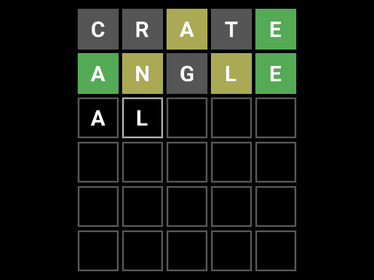

   

# Asicle v2

Asicle is a Wordle clone in raw silicon. Originally taped out on MPW6, version 2 is a port to Tiny Tapeout. This repository is targeting the ttgf0p2 shuttle.

Repository organisation:
- [Project documentation](docs/info.md) including instructions for testing are under `docs`.
- [RTL sources](src) are in the `src` directory. The top module is `project.sv`. I/O handling through the Gamepad, QSPI and Tiny VGA Pmods are split into `input_*.sv`, `qspi_*.sv` and `vga_*.sv`. The rest of the game logic is in `game_*.sv`.
- A [cocotb testbench](test) is included in the `test` directory, used both for RTL and GL tests. It captures frames from a simulated gameplay and compares it to reference images.
- [FPGA build scripts](fpga) for Pico-ice, ULX3S and Basys 3 are in the `fpga` directory. They can be adapted to other boards in the Ice40, ECP5 and Xilinx 7 families by changing the board config.
- [Word lists and font bitmaps](data), as well as the script building the flash image from them, is under `data`.
- The [Tiny Tapeout project information](info.yaml) is in `info.yaml`.
- [CI builds](.github/workflows) using the Tiny Tapeout build & test setup are configured in `.github/workflows`.

