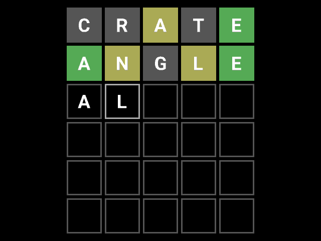

## How it works

Asicle is a Wordle clone implemented directly in hardware. A [first version](https://github.com/htfab/asicle)
of it was taped out on the Google-Skywater MPW6 shuttle. This second version is a rewrite for Tiny Tapeout.

The 25-fold decrease in area mostly comes from moving the word list and font bitmaps to external flash on
the [QSPI Pmod](https://github.com/mole99/qspi-pmod), with some architectural changes to compensate for slower
memory access. The design was also adapted to the Tiny Tapeout ecosystem by using the
[Gamepad Pmod](https://github.com/psychogenic/gamepad-pmod) for input and the
[Tiny VGA Pmod](https://github.com/mole99/tiny-vga) for output.

## How to test

- Connect the Pmods:
  - Gamepad to input port (optional, you can also drive the input pins using the commander app or momentary push buttons)
  - QSPI to bidirectional port
  - Tiny VGA to output port
- Flash the [data file](https://github.com/htfab/asicle2/blob/main/data/asicle.bin) to the QSPI Pmod using the [Tiny Tapeout flasher](https://tinytapeout.github.io/tinytapeout-flasher/)
- Select the design
- Set the clock to 25.175 MHz and reset the design
- Play the game

If you haven't played Wordle before, the aim is to guess a five-letter English word in six attempts.
Each time you get feedback: a green square indicates that the letter is correct, a yellow square indicates
that it appears in the hidden word but at a different position, and a grey square means that the letter
doesn't appear in the solution at all.

Gamepad controls:
- <kbd>🠝</kbd> <kbd>🠟</kbd>: change the letter in the selected position
- <kbd>🠜</kbd> <kbd>🠞</kbd>: move the selection
- <kbd>A</kbd>: make a guess
- <kbd>START</kbd>: start a new game (if the current one is finished)
- <kbd>SELECT</kbd>+<kbd>START</kbd>: start a new game (any time)
- <kbd>SELECT</kbd>+<kbd>X</kbd>: show the solution\*
- <kbd>SELECT</kbd>+<kbd>Y</kbd>: re-roll the solution\*

(\* only in debug mode)

Direct input using `ui_in`:
- <kbd>0</kbd> <kbd>1</kbd>: change the letter in the selected position
- <kbd>2</kbd> <kbd>3</kbd>: move the selection
- <kbd>4</kbd>: make a guess
- <kbd>5</kbd>: start a new game
- <kbd>6</kbd>: show the solution
- <kbd>7</kbd>: re-roll the solution

## External hardware

- [Tiny VGA Pmod](https://github.com/mole99/tiny-vga)
- [QSPI Pmod](https://github.com/mole99/qspi-pmod)
- [Gamepad Pmod](https://github.com/psychogenic/gamepad-pmod) (optional)

